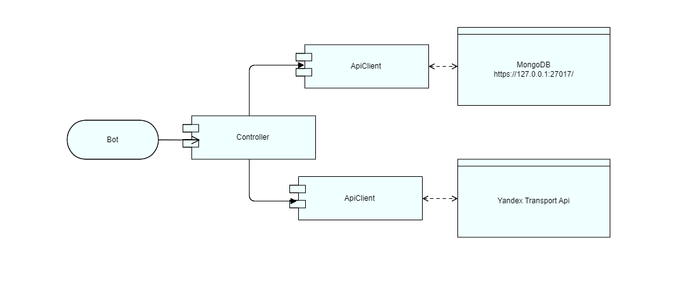
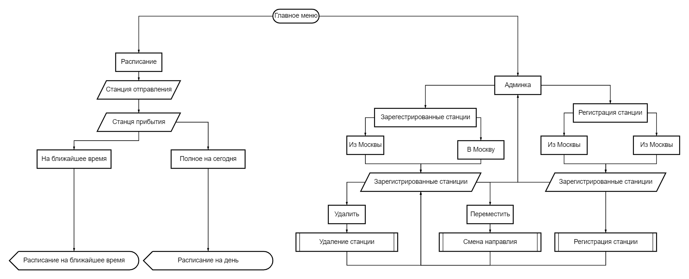

# Jheldor`s Brotherhoods Bot
*Бот с расписанием электричек*
## Функции
- Присылает расписание с доступных станций.
- Позволяет добавлять / редактировать / удалять доступные станции.
- При отправке расписания определяет тип поезда и его загруженность по встроенному алгоритму.
## Архитектура сервиса

Архитектура сервиса нарисована с помощью [сервиса](https://online.visual-paradigm.com)
## Бот
### Библиотека
Для написания бота использована библиотека [`python-telegram-bot==20.5`](https://python-telegram-bot.org/)
### Cхема бота

Диаграма бота нарисована с помощью [сервиса](https://programforyou.ru/block-diagram-redactor)